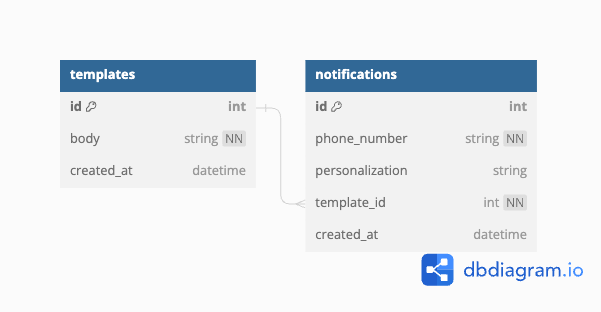

<div align="center">
  <h1>NotifyMe, a RESTful Python API</h1>
  <div align="center"></div>
</div>
<br>

NotifyMe was designed and developed to simulate a text notification service.  The application contains seven endpoints for creating, reading, and updating templates and notifications, as well as a robust testing suite exploring both happy and sad user paths.

<br>

## Table of Contents

- [Planning and Design](#planning-and-design)
- [Developer Setup](#developer-setup)
- [How to Run Test Suite](#how-to-run-test-suite)
- [Available Endpoints](#available-endpoints)
- [Stretch Goals and Refactors](#stretch-goals-and-refactors)
<br>

## Planning and Design



<br>

*Design Decisions:*

- In place of an Object Relational Mapper, raw SQL queries were used to obtain appropriate database information
- All endpoints methods contained in single ```app.py``` file to reflect simplicity of application

<br>

## Developer Setup

<ol>
  <li>Clone this repository</li>
  <li><code>cd</code> into the root directory</li>
  <li>Create virtual environment <code>python3 -m venv .venv</code></li>
  <li>Activate virtual environment <code>source .venv/bin/activate</code></li>
  <li>To install requirements run: <code>pip3 install -r requirements.txt </code></li>
  <li>To run locally and request endpoints: <code>flask --app app run</code></li>
</ol>
<br>

## How to Run Test Suite

- ```cd``` into the root directory
- While in an active virtual environment, run ```pytest``` in the command line

## Available Endpoints

<details close>
<summary>Get all Templates</summary><br>

  - GET "/template" 
  - Sample response body: 
    ```
    [
        {
            "body": "Hello, (personal). How are you today, (personal)?",
            "id": 1
        },
        {
            "id": "Goodbye, (personal). Have a great day, (personal)!",
            "id": 2
        }
    ]
    ```
  
</details>

<details close>
<summary>Get one Template</summary><br>

  - GET "/template/1"
  - Sample response body: 
    ```
    {
        "body": "Hello, (personal). How are you today, (personal)?",
        "id": 1,
    }
    ```
</details>

<details close>
<summary>Create a Template</summary><br>

  - POST "/template"<br>
  - Sample request body: <br>
    ```
    {
        "body": "Happy birthday, (personal)!"
    }
    ```
  - Sample response body: <br>
    ```
    {
        "body": "Happy birthday, (personal)!",
        "id": 3
    }
    ```
</details>


<details close>
<summary>Update a Template</summary><br>

  - PUT "/template/3"<br>
  - Sample request body: <br>
    ```
    {
        "body": "Many happy returns, (personal)!"
    }
    ```
  - Sample response body: <br>
    ```
    {
        "body": "Many happy returns, (personal)!",
        "id": 3
    }
    ```
</details>

<details close>
<summary>Get all Notifications</summary><br>

  - GET "/notification"<br>
  - Sample response body: <br>
    ```
    [
        {
            "id": "1",
            "personalization": "Jenny",
            "phone_number": "+15208675309",
            "template_id": 1
        },
        {
            "id": "2",
            "personalization": "Linda",
            "phone_number": "+12125554444",
            "template_id": 2
        },
        {
            "id": "3",
            "personalization": "Joe",
            "phone_number": "+12022051600",
            "template_id": 1
        }
    ]
    ```
</details>

<details close>
<summary>Get one Notification</summary><br>

  - GET "/notification/1"
  - Sample response body:
    ```
    {
        "content": "Hello, Jenny. How are you today, Jenny?"
        "id": "1",
        "personalization": "Jenny",
        "phone_number": "+15208675309",
        "template_body": "Hello, (personal). How are you today, (personal)?"
    }
    ```
</details>

<details close>
<summary>Create a Notification</summary><br>

  - POST "/api/v1/favorites"<br>
  - Sample request body: <br>
    ```
    {
        "phone_number": "+15709876543",
        "personalization": "Michael Scott",
        "template_id": 2
    }
    ```
  - Sample response body: <br>
    ```
    {
        "content": "Goodbye, Michael Scott. Have a great day, Michael Scott!"
        "id": "4",
        "personalization": "Michael Scott",
        "phone_number": "+15709876543",
        "template_body": "Goodbye, (personal). Have a great day, (personal)!"
    }
    ```
</details>

## Stretch Goals and Refactors

- Coverage reports
- Containerization using Docker
- Creating YAML file to display user endpoints graphically with Swagger UI
- DRY-ing up code in ```app.py``` file to slim down methods
- Mocking test data using factories
- Using an ORM (such as SQLAlchemy) to convert information into objects for easier data manipulation
- Abstracting models, routes, and controllers into an MVC-style architecture

<p align="right">(<a href="#top">back to top</a>)</p>
